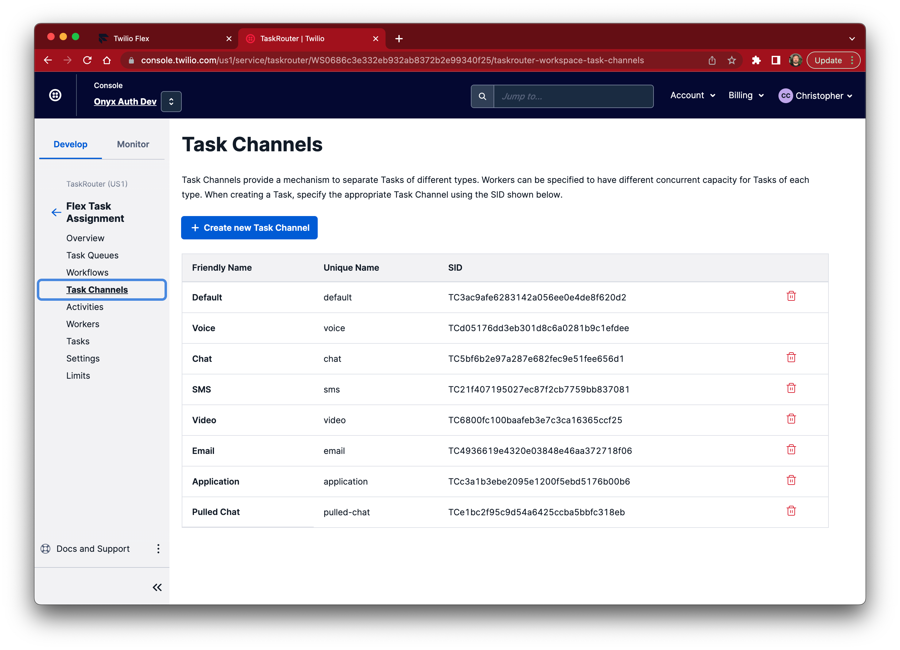
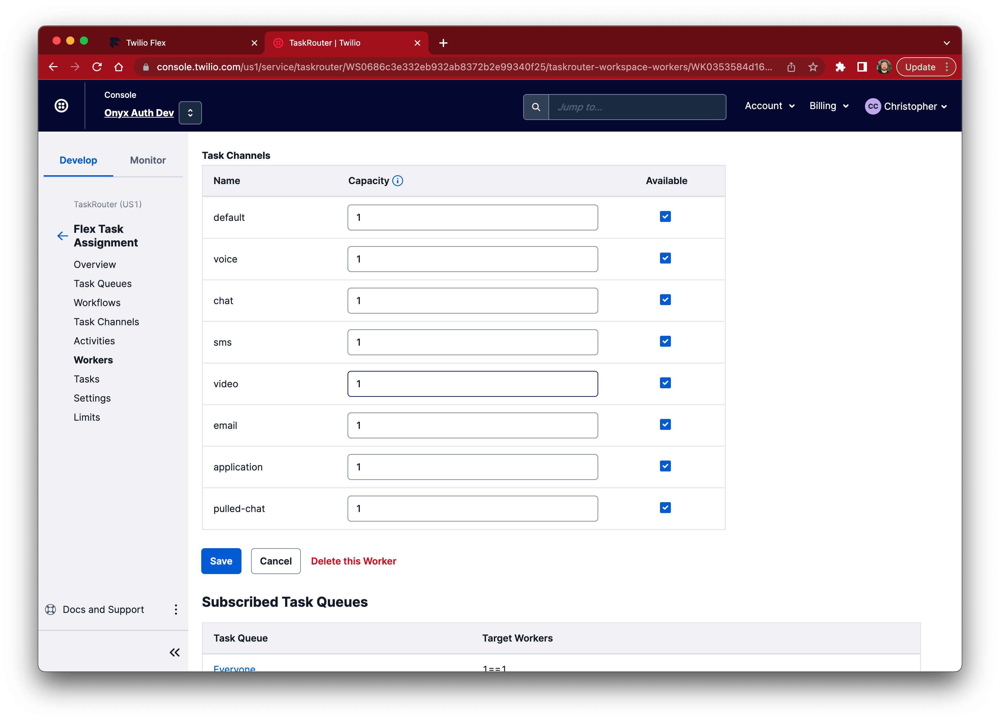

# Pulled Chats

This plugin and description below provide a mechanism to have a second chat channel for "pulled chats" for an agent.  This may be useful in situations such as:
- Enabling an agent to "pull" specific chat tasks into Flex immediately
- Allowing a task to "bypass" existing routing to be delivered to a specific worker
- Providing an option to handle important chat interactions without interfering with default capacities
- Enabling chats to be delivered to a worker when they have reached maximum active tasks and or reservations
- Reporting on manually handled interactions

The way this is achieved is through creating an additional Task Router _channel_.  This channel needs to be uniquely named and it's recommended the name is something sensible that may be used in Flex Insights reporting, in this example the channel is called "pulled-chats" to represent interactions that have been manually fetched by a worker to handle immediately.

A very small (4 lines) of code is required simply to tell Flex that this newly created channel should be treated the same as a chat channel. For further details on Flex Plugins refer to our documentation on the [Task Channel Definition](https://www.twilio.com/pt-br/docs/flex/developer/ui/task-channel-definitions) page.

The critical code is here:
```ts
const pulledChatChannel = Flex.DefaultTaskChannels.createChatTaskChannel(
  "pulled-chat",
  (task) => true
);
Flex.TaskChannels.register(pulledChatChannel, true);
```

By using the `createChatTaskChannel` and passing the `true` variable in the `register` method we ensure that all of the chat capabilities are inherited

## Configuring Task Router
In Task Router > Workspaces > Flex Task Assignment > Task Channels, create a new channel (e.g. `pulled-chat`)



Each worker will now have a default capacity assigned for this channel that Task Router will take into account when attempting to assign tasks to the worker through the use of reservations.



## Changing an Task channel type

Using the Twilio API a call is made to update the task, in the example below we use the twilio-cli to update the `task-channel` using the unique name we created earlier.

```bash
twilio api:taskrouter:v1:workspaces:tasks:update \
    --workspace-sid WS0xxxxxxxxxxxxxxxxxxxxxxxxxxxxxxx \
    --sid WTxxxxxxxxxxxxxxxxxxxxxxxxxxx \
    --task-channel "pulled-chat"
```

More details including sample code in a variety of languages is located on the Twilio Task Router documentation page [here](https://www.twilio.com/docs/taskrouter/api/task)